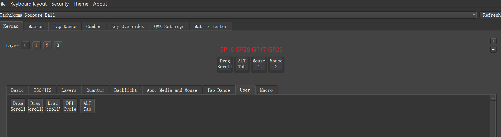

# NoMouseBall

A trackball based on RP2040+PMW3360+QMK+VIAL
I created this project by referring these projects:

1. PCB: [rp2040-pmw3360](https://github.com/jfedor2/rp2040-pmw3360) 
2. 3D Model:[ballin-rp2040-trackball](https://github.com/SamIAm2000/ballin-rp2040-trackball/tree/main) 
3. The QMK firmware: [pmw3360-pcb](https://github.com/siderakb/pmw3360-pcb/tree/main/firmware/qmk/pmw3360_rp2040) 

Based on above projects, I create a QMK/Vial firmware and added some interesting custom keycodes: 
1. DRAG_SCROLL: Holding on will activate 'scroll' model, support horizon and vertical.
2. DRAG_SCROLL_H: Holding on will activate 'scroll' model, only support horizon.
3. DRAG_SCROLL_V: Holding on will activate 'scroll' model, only support vertical.
4. DPI_CYCLE: change mouse DPI among 800,1600,2400,3600.
3. ALT_TAB: Tap to send a 'alt+tab', holding to activate windows multiple tasks view.(Like 3 fingers gesture in trackpad)

You can use [Vial](https://vial.rocks/) to configure buttons and use some advanced features for button. (e.g. combos, tap and holding)
Vial is a good tool. When you want to flash the firmware, you don't need to remove the trackball shell and press reset button on PCB. Just configuring the 'Boot Loader' keycode to a button then click it!

# Firmware

## The Pins for Buttons

I use these RP2040 pins for trackball buttons: `GP16",  "GP28",  "GP17",  "GP26"`. You can adjust QMK code to support more.

## Flash the Firmware

You can use the `firmware/nomouse_ball_vial.uf2` file to flash RP2040 directly.
If you want to change the firmware code by yourself, please prepare the QMK/Vial env and copy the `firmware/nomouse_ball` under your `<QMK/Vial project>/keyboards` folder. Then follow the QMK/Vial compile instruction compile the firmware.
